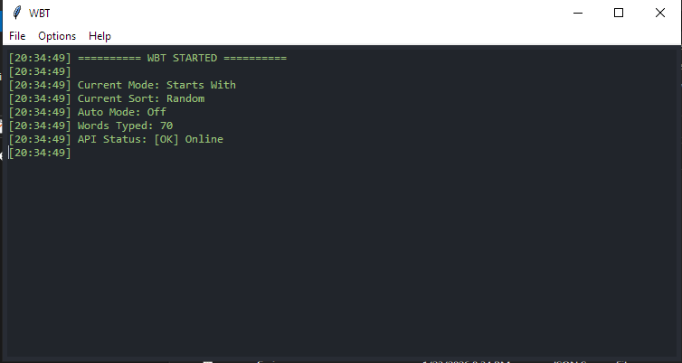
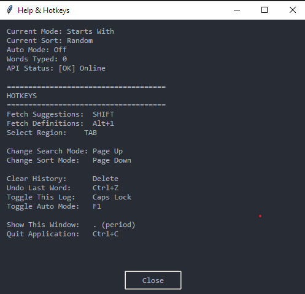

# Word Bomb Tool - Setup Instructions

## Screenshots & Video

### Screenshots



*Figure 1: Main interface of the Word Bomb Tool*




*Figure 2: Word suggestion and game interaction*


*Figure 3: Application in action*


## Options

- **Select Region**: Press `TAB` to select a region.
- **Auto Mode**: Press `F1` to toggle auto mode.
- **Exit Program**: Press `Ctrl+C` to exit the program.
- **Show/Hide window**: Press `Caps Lock` to toggle the log window and the selected region outline together.
- **Show/Hide help**: Press `.` to toggle the help window.
- **Change Search Mode**: Press `Page Up` to change the search mode.
- **Change Sort Mode**: Press `Page Down` to change the sort mode.
- **Clear History**: Press `Delete` to clear the history.
- **Undo Last Word**: Press `Ctrl+Z` to undo the last word.
- **Fetch Suggestions**: Press `SHIFT` to fetch suggestions.
- **Fetch Definitions**: Press `Alt+1` to fetch definitions.

## How to use

1. Go to `Options` -> `Select region` and select the block that shows the characters.

2. Press `SHIFT` to fetch a suggestion or `F1` to toggle auto mode.

3. Press `Ctrl+C` to exit the program.

## How It Works

- **OCR/Manual Input**: Simply enter/reads the letters from the Word Bomb game board/selected region.
- **Call Api**: Fetch word suggestions from [Datamuse API](https://api.datamuse.com/words).
- **Typing**: Automatically types the suggested word into the game.
- **Wait**: Waits for `the game to ask for a word` or `the user to press shift/f1` before repeating the process.


--- 


## Prerequisites

- Python 3.6 or higher
- [Tesseract Ocr for windows x64 5.5](https://github.com/tesseract-ocr/tesseract/releases/download/5.5.0/tesseract-ocr-w64-setup-5.5.0.20241111.exe)

## Installation

1. Clone the repository:

```bash
git clone https://github.com/mPhpMaster/word-bomb-tool.git
```

1. Install Python dependencies:

```bash
pip install -r requirements.txt
```

## Usage

### GUI (hotkeys, OCR, tray)

1. Run the script:

```bash
python main.py
```

or

```powershell
run.bat
```

or

```bash
run.sh
```

or just double-click on [run.vbs](run.vbs).

### CLI (no GUI — suggestions & definitions only)

Uses the same Datamuse logic as the desktop app; no Tesseract or keyboard hooks required.

```bash
python cli.py suggest LETTERS [--mode MODE] [--sort SORT] [--limit N]
python cli.py define WORD
python cli.py modes
```

Examples:

```bash
python cli.py suggest abc --mode starts-with --sort shortest -n 10
python cli.py define puzzle --json
```

On Windows you can use `run-cli.bat` the same way (pass arguments after the batch name).

### Windows executables (PyInstaller)

From the project folder, install build tools and produce two one-file programs in `dist\`:

```powershell
build_exe.bat
```

This installs `requirements.txt` plus `requirements-build.txt` (PyInstaller), then builds:

- `dist\WordBombGUI.exe` — same as `python main.py` (still needs [Tesseract](https://github.com/tesseract-ocr/tesseract) installed separately for OCR).
- `dist\WordBombCLI.exe` — same as `python cli.py ...` (pass subcommands after the executable, e.g. `WordBombCLI.exe suggest cat -n 5`).

Config, logs, and `ocr_metrics.json` are written next to the `.exe` you run.

Manual build:

```powershell
pip install -r requirements.txt -r requirements-build.txt
pyinstaller --noconfirm --clean word-bomb-gui.spec
pyinstaller --noconfirm word-bomb-cli.spec
```


## Troubleshooting

- **No words found**: Make sure you entered the correct letters.

## Support

[Donate via PayPal](https://www.paypal.com/paypalme/mfsafadi)

## Disclaimer

This is for educational purposes. Use responsibly and check Discord's terms of service.

Licensed under the MIT License. See [LICENSE](LICENSE) for details.
