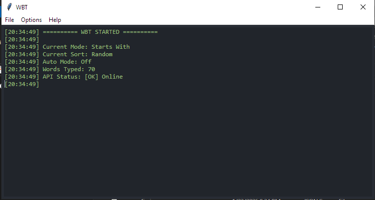
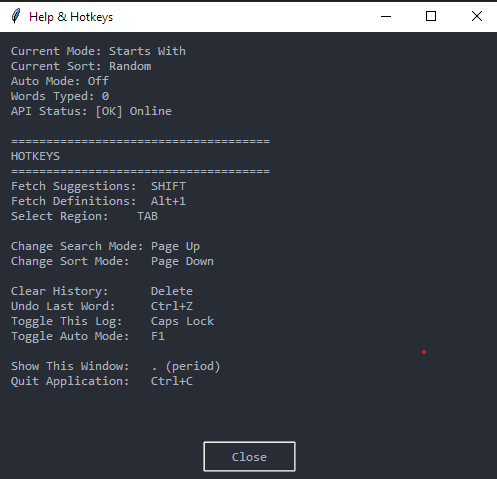

# Word Bomb Tool - Setup Instructions

## Screenshots & Video

### Screenshots



*Figure 1: Main interface of the Word Bomb Tool*




*Figure 2: Word suggestion and game interaction*


*Figure 3: Application in action*


## Options

- **Select Region**: Press `TAB` to select a region.
- **Auto Mode**: Press `F1` to toggle auto mode.
- **Exit Program**: Press `Ctrl+C` to exit the program.
- **Show/Hide window**: Press `Caps Lock` to toggle the log window and the selected region outline together.
- **Show/Hide help**: Press `.` to toggle the help window.
- **Change Search Mode**: Press `Page Up` to change the search mode.
- **Change Sort Mode**: Press `Page Down` to change the sort mode.
- **Clear History**: Press `Delete` to clear the history.
- **Undo Last Word**: Press `Ctrl+Z` to undo the last word.
- **Fetch Suggestions**: Press `SHIFT` to fetch suggestions.
- **Fetch Definitions**: Press `Alt+1` to fetch definitions.
- **Fast typing**: `Options` -> `Fast typing (on/off)`. On by default: no "thinking" pause, 12ms between keys and a short pause before Enter. Off uses the human-like timing set by `Options` -> `Typing delay...`. Saved as `fast_typing` in `ocr_config.json`.
- **About**: `Help` -> `About Word Bomb Tool…` (also in the tray menu when the tray icon is available).

## How to use

1. Go to `Options` -> `Select region` and select the block that shows the characters.

2. Press `SHIFT` to fetch a suggestion or `F1` to toggle auto mode.

3. Press `Ctrl+C` to exit the program.

## How It Works

- **OCR**: Reads the letters in the selected region with the OCR engine built into Windows (`Windows.Media.Ocr`, in-process, a few ms per read). English and Arabic prompts are supported; Arabic needs the Arabic OCR language (Windows Settings -> Time & language -> Language: add Arabic). Tesseract is only used when Windows has no OCR language installed.
  - The region outline is drawn just outside the region and hidden from screen capture, and small text (such as a "1K" counter), frames and specks inside the region are ignored.
  - Only prompts of 2+ Latin (a-z) or Arabic letters are used; anything else is logged and nothing is typed.
- **Suggestions**: `Starts With`, `Ends With` and `Contains` come from built-in offline word lists (English: ENABLE, shortest words first; Arabic: most common words first). Letters no word contains are treated as a misread and nothing is typed. A capital I read as a lowercase l is corrected when the swapped letters match at least ten times as many words. `Rhymes` and `Related Words` use the [Datamuse API](https://api.datamuse.com/words) (English only; Arabic prompts use `Contains` instead), as do definitions (`Alt+1`).
- **Typing**: Types the suggested word into the game (Arabic words are typed as Unicode, so no Arabic keyboard layout is needed). Before Enter the letters are read again; a change only counts after 3 identical reads in a row of letters some word contains, so a shaking bomb does not erase correct words.
- **Wait**: Waits for `the game to ask for a word` or `the user to press shift/f1` before repeating the process.


--- 


## Prerequisites

- Windows 10 version 2004 or later (for the built-in OCR engine and for hiding the region outline from capture)
- Python 3.10 or higher (to run from source)
- Optional: the Arabic OCR language in Windows, for Arabic prompts
- Optional: [Tesseract OCR for Windows x64 5.5](https://github.com/tesseract-ocr/tesseract/releases/download/5.5.0/tesseract-ocr-w64-setup-5.5.0.20241111.exe) — only needed when Windows has no OCR language installed

## Installation

1. Clone the repository:

```bash
git clone https://github.com/mPhpMaster/word-bomb-tool.git
```

1. Install Python dependencies:

```bash
pip install -r requirements.txt
```

## Usage

### GUI (hotkeys, OCR, tray)

1. Run the script:

```bash
python main.py
```

or

```powershell
run.bat
```

or

```bash
run.sh
```

or just double-click on [run.vbs](run.vbs).

### CLI (no GUI — suggestions & definitions only)

`Starts With` / `Ends With` / `Contains` use the same offline word lists as the desktop app (English or Arabic letters); `Rhymes`, `Related Words` and `define` use Datamuse. No OCR or keyboard hooks required.

```bash
python cli.py suggest LETTERS [--mode MODE] [--sort SORT] [--limit N]
python cli.py define WORD
python cli.py modes
```

Examples:

```bash
python cli.py suggest abc --mode starts-with --sort shortest -n 10
python cli.py define puzzle --json
```

On Windows you can use `run-cli.bat` the same way (pass arguments after the batch name).

### Windows executables (PyInstaller)

From the project folder, install build tools and produce two one-file programs in `dist\`:

```powershell
build_exe.bat
```

This installs `requirements.txt` plus `requirements-build.txt` (PyInstaller), then builds:

- `dist\WordBombGUI.exe` — same as `python main.py` (uses the Windows OCR engine; the word lists are built in).
- `dist\WordBombCLI.exe` — same as `python cli.py ...` (pass subcommands after the executable, e.g. `WordBombCLI.exe suggest cat -n 5`).

Config, logs, and `ocr_metrics.json` are written next to the `.exe` you run.

### Windows installer (Inno Setup)

After building the executables, create a Windows installer package with Inno Setup 6:

```powershell
build_installer.ps1
```

or:

```cmd
build_installer.bat
```

The installer output is:

- `dist\WordBombTool-Setup.exe`

It installs:

- `WordBombGUI.exe`
- `WordBombCLI.exe`
- `ocr_config.json`
- `LICENSE`
- `THIRD_PARTY_NOTICES.md` and `ARABIC-WORDS-NOTICE.md`
- `README.md`
- shortcuts for `WordBombGUI.exe` and `WordBombCLI.exe`

If `ISCC.exe` is not found, install Inno Setup 6 and ensure the compiler is available on `PATH`.

Manual installer build (after `build_exe.bat`):

```powershell
ISCC.exe /Qp word-bomb-installer.iss
```

Manual build:

```powershell
pip install -r requirements.txt -r requirements-build.txt
pyinstaller --noconfirm --clean word-bomb-gui.spec
pyinstaller --noconfirm word-bomb-cli.spec
```


## Tests

```bash
python -m unittest discover -s tests -t .
```

The OCR tests read synthetic prompts and two real game captures (`tests/samples`) with the Windows OCR engine; they are skipped when no Windows OCR language is installed.

## Troubleshooting

- **No words found**: Make sure you entered the correct letters.
- **"No word contains '...'" in the log**: the letters were misread; check that the region (TAB) covers only the prompt letters.
- **Arabic prompts are not read**: install the Arabic OCR language in Windows (the log line at startup says which OCR languages are in use).

## Support

[Donate via PayPal](https://www.paypal.com/paypalme/mfsafadi)

## Disclaimer

This is for educational purposes. Use responsibly and check Discord's terms of service.

Licensed under the MIT License. See [LICENSE](LICENSE) for details, and [THIRD_PARTY_NOTICES.md](THIRD_PARTY_NOTICES.md) for the bundled word lists and libraries (the Arabic word list is CC BY-SA 4.0).
